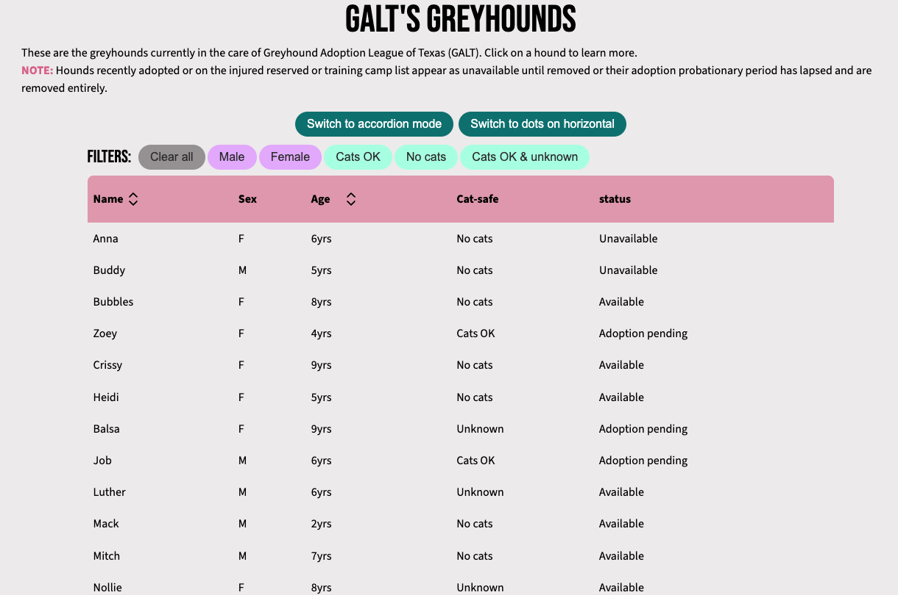
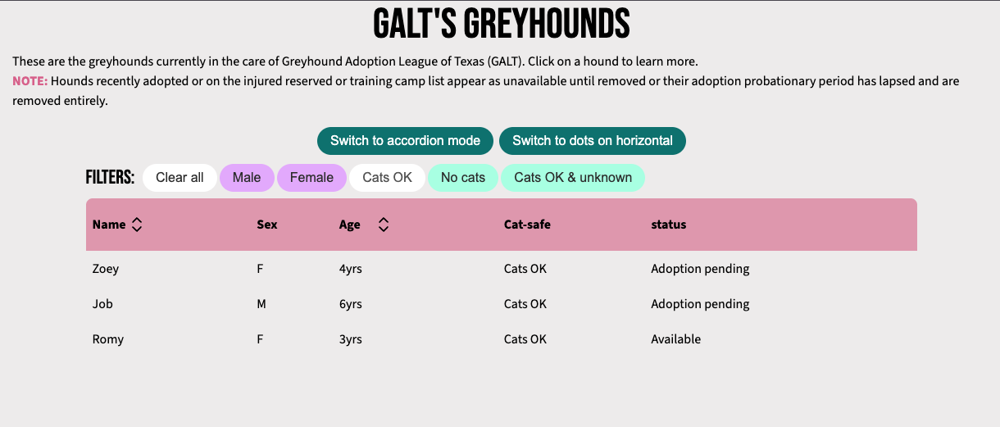
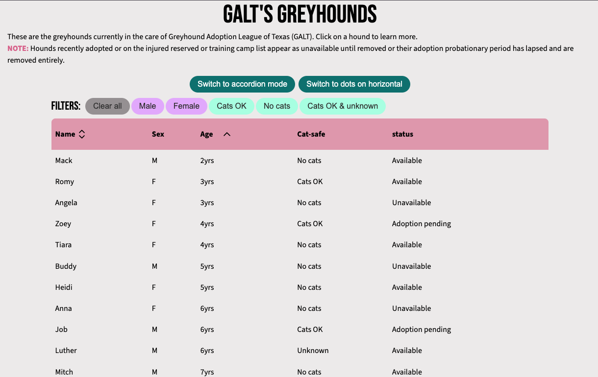
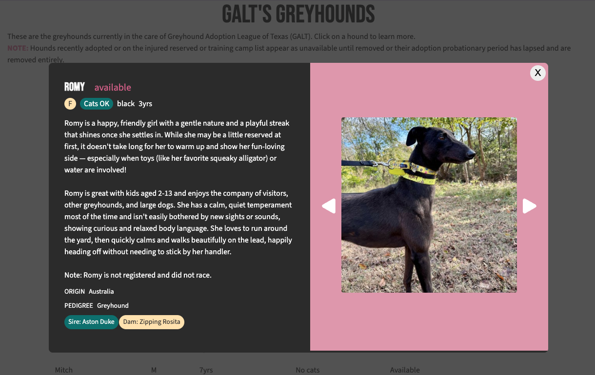
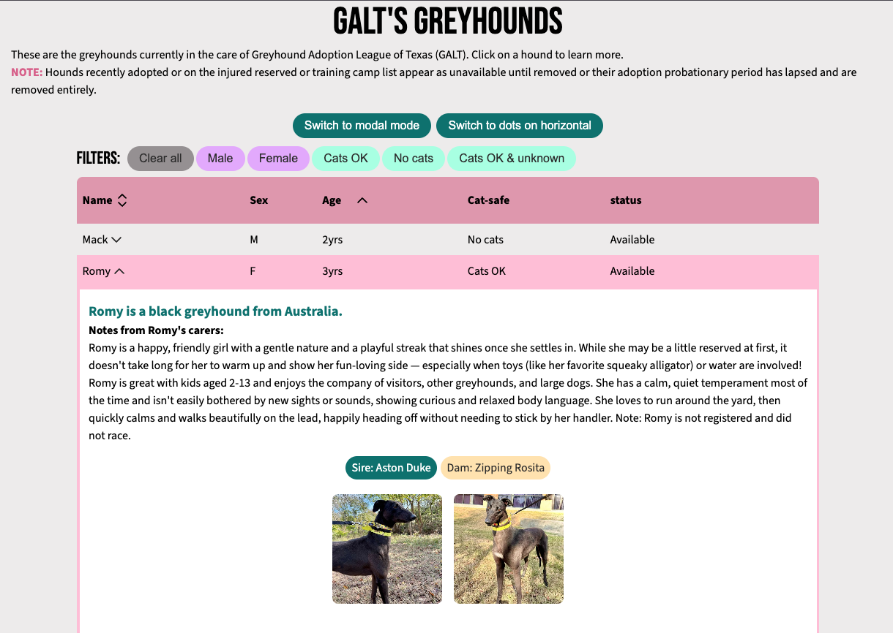
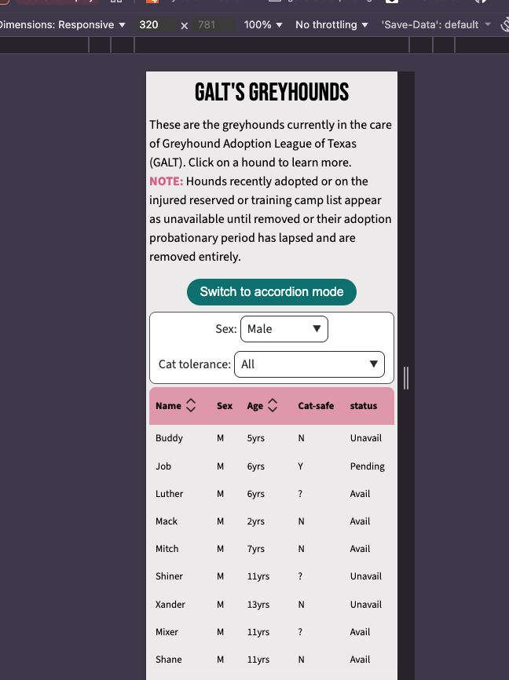
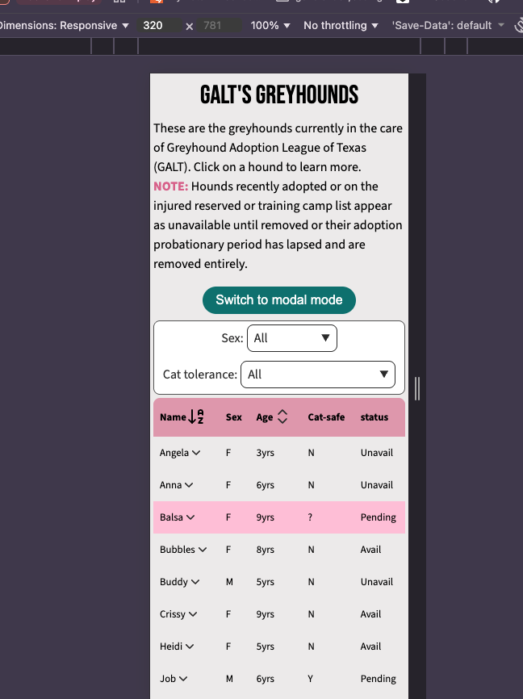
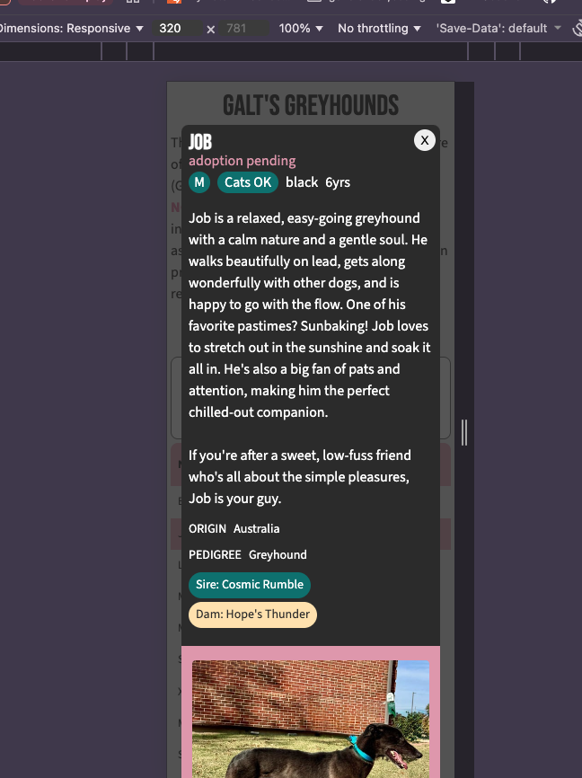
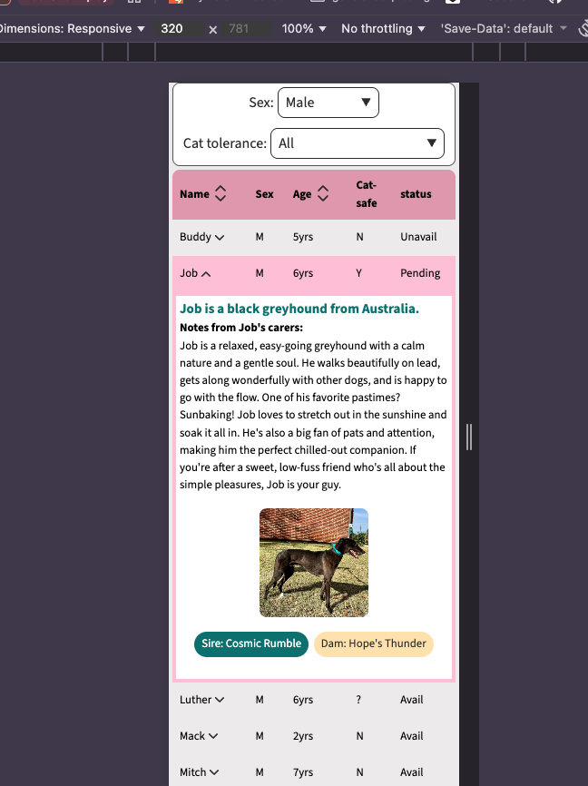

# Available Hound Data

## What
A demo app to focus on bringing data in, displaying as a table, and on row-click display a separate card or expand as accordion.

What this demo covers:
* Filtering (select on mobile & button on desktop)
* Sorting with animation
* Table row interactions (click, expand, highlight)
* Portals/modals
* Data fetching
* Custom hooks (useDogSort, useDogFilter)
* A11y dedication (roles, contrast, keyboard navigation, checked with [WebAIM contrast checker](https://webaim.org/resources/contrastchecker/) )
* animations:
  * chevrons up and down (sorting)
  * expandable drawers on click
  * modal
  * sorting columns show/hide text (e.g. name becomes A to Z when sorting asc)

Buttons in the header allow for options: 
- accordion or modal mode: when the user clicks a row, will the extra info show as a modal or an expanded drawer?
- dots on horizontal: the slideshow defaults to dots on mobile and arrows on horizontal (900px). This allows for dots to also be on horizontal. There is no option for arrows at mobile. I could, but as a user, I hate that UI, so ... my repo; my rules.

## Why
Just to have as a reference for when I do sorting, hooks, etc. again. The data is hardcoded from the GALT website, so it is not current; I update when I know new dogs have arrived. 

## Who
... was my latest foster? Zoey (now Pepper). Important for a README? Probably not, but she was the best foster and I want to see her face foreverrrrr.

## How
* Vite
* React
* Lucide (icons)
* Data comes from galtx.org but not by way of scraping--just my tippy tappy typing

## Screenshots
### desktop

### mobile

